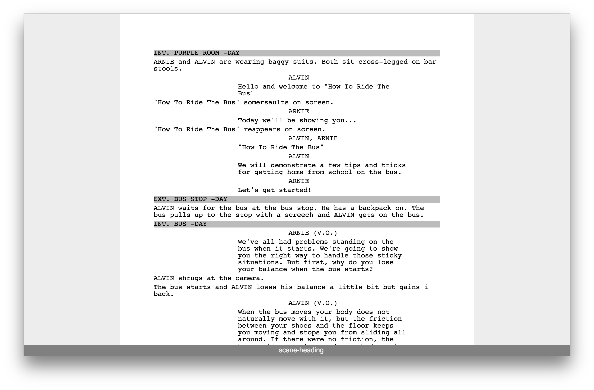

#Screenwriter
Screenwriter is a free solution to the lack of quality screenwriting applications. It's goal is to be simple and easy to use without a clunky interface. If you want the latest build of Screenwriter go [here](http://blockaj.github.io/screenwriter).

##Features
-[]Format text like screenplay
    -[x]Format character, scene headings, dialogue, etc. 
    -[]Add page numbers
-[x]Export to pdf 
-[x]Print
-[]Version control
##Contributing
Screenwriter is a very new project. If you'd like to contribute I recommend downloading the latest build and reporting issues. 
##Changelog
###[0.1.0] -2015-05-14
####Added
- Basic screenplay formatting, excluding title page, page numbers
- Export to PDF 

